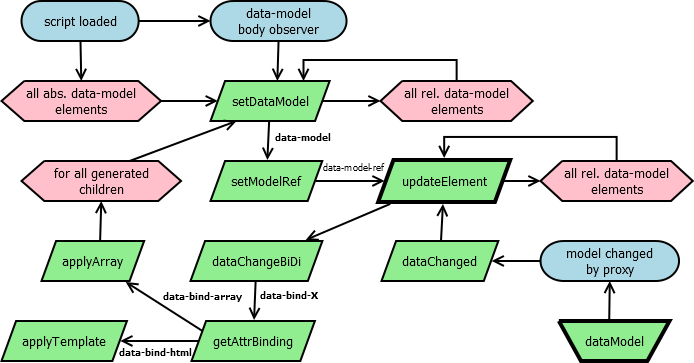

# Reactivity framework implementation

Albeit the reactivity makes only a small portion of the overall size of the many JS frameworks, their monolithic architecture prevents to separate it cleanly <sup>1</sup>.

<sup>1</sup> <small>*To be fair, Aurelia is divided into 31 folders with 10 statically imported dependencies in aurelia-framework, so only those 11 makes the monolith.*</small>

### Fake size
Fake size is what the developers lie about.

Firstly, JS interprets can't process gzipped files. They are created only because the server can HTTP negotiate compressed transfers, so the gzipped size is relevant only for network load. Today, 4G+ networks are fast enough to make the effect negligible in most cases (it can admittably alleviate the load of CDN servers). On the other hand, the need to decompress the file means additional processor load and battery drain for mobile devices, which is still signifficant today. Therefore, the gzipping JS files is probably not a good idea in these days.

Secondly, the creators allways brag with the unreadable minified code size, but also add no-responsibility disclaimer. So either you trust someone who has no responsibility or you have to read through and understand the development code with tenfold size (comparable with the size of Bible). The sheer size introduces many confusion to essentially simple ideas like reactivity, see the [eye-opener 2 min video](https://youtu.be/lc5Np9OqDHU) from Douglas Crockford. To make a first-shot concept, [H framework](H.js) was proposed as a temporary solution based on [general reactivity framework proposal](README.md).

## Size comparison

How much code do we need to implement reactivity?

Below is the size of the H framework concept compared to some popular web frameworks.

|Framework|dev size|fake size|node_modules|
|---|---|---|---|
|H|6.66 kB|1.96 kB|0|
|Aurelia|445 kB*|41 kB*|194 MB|
|Knockout|317 kB|25 kB|0|
|React|1.1 MB**|34.8 kB|185 MB|
|Svelte|951 kB***|1.6 kB|25 MB|
|Van|3.58 kB|0.8 kB|0|
|Vue|641 kB****|33.9 kB|14.8 MB|

- &shy;* node_modules/aurelia-framework/dist/commonjs/aurelia-framework.js + dependencies, fake size taken from bundlephobia reduced proportionally to the fraction of the size involving reactivity
- ** react.development.js + react-dom.development.js
- *** compiler + runtime + shared
- **** node_modules/vue/dist/vue.global.js

## Implementation comparison

Below is the code samples of the selected frameworks demonstrating their reactivity and rewritten in H framework to prove that the H code is cleaner in all cases.

|Framework|sample app|H adaptation|
|---|---|---|
|Aurelia|[ToDo list](https://aurelia.io/docs/tutorials/creating-a-todo-app/)|[ToDo list](https://janturon.github.io/Htodo.html)|
|Knockout|[Bert](https://learn.knockoutjs.com/#/?tutorial=intro)|[Bert](https://janturon.github.io/Hbert.html)|
|React|[TicTacToe](https://react.dev/learn/tutorial-tic-tac-toe)|[TicTacToe](https://janturon.github.io/Htictactoe.html)|
|Svelte|[Doubled](https://svelte.dev/examples/reactive-declarations)|[Doubled](https://janturon.github.io/Hdoubled.html)|
|Van|[Calculator](https://vanjs.org/demo#calculator)|[Calculator](https://janturon.github.io/Hcalc.html)|
|Vue|[Increment](https://vuejs.org/guide/essentials/reactivity-fundamentals.html#script-setup)|[Increment](https://janturon.github.io/Hincrement.html)|

Van's approach to calculator is very conscise (and thus easy to understand), although it lacks some functionality (division by zero allowed and returns incorrect Infinity, multiple decimal dots allowed, 0.2 * 3 returns wrong result), it is by comparison far more comprehensible than [React's calculator](https://github.com/ahfarmer/calculator) where the fragmentation impedes to see the complete logic even in such simple application (one has to study the code fragment by fragment). This seems to be the motivation for the very existence of Van.js: in the H1 on their homepage they say "without React/JSX".

The drawback of Van's syntax (same as in React) is that from `div(displayNum)` it is not clear if the `displayNum` is reactive or not and one must look-up if the definition is `state()` or not. This is not so in H, where everything in the context of `data-bind-X` attribute is reactive.

## Public interface

To use H framework, create data models by `H.dataModel(obj)` function, assign them to DOM subtree by `data-model` attribute and do the data bindings by `data-bind-X` attributes. Detailed description follows.

### H.dataModel(obj)

Creates a dataModel proxy from object `obj`, the result can be referenced in `data-model` attribute, which sets the model for all the subtree elements adhering to the [general rules](README.md#data-models).

```
<script>
User = H.dataModel({
    name: 'John',
    age: 42
});
</script>

<div data-model="User"></div>
```

### H.getDataModel(elem, source=false)

Gets the data model (the proxy) of the HTML element `elem`. If `source` is set to true, it returns the data source instead (the change of the data source isn't reactive, the change of the data model is).

```
<script>
System = {
    users: [
        {name: "John", role: "designer"},
        {name: "Jack", role: "coder"},
        {name: "Joe", role: "saler"}
    ]
};
ModelSystem = H.dataModel(System);
</script>

<div data-model="ModelSystem">
    <div data-model=".users">
        <div data-model="[0]" id="test">
        </div>
    <div>
</div>

<script>
    test = document.getElementById("test");
    model = H.getDataModel(test); // ModelSystem.users[0]
    source = H.getDataModel(test, true); // System.users[0]
    // source = Object.getPrototypeOf(model); // System.users[0]
</script>
```

### H.isModel(obj)

Tests if `obj` is data model. Data models have `Symbol.for("H.model")` property defined.

```
<script>
    H.isModel(ModelSystem); // true
    H.isModel(System); // false
</script>
```

### data-bind-X

Element having `data-bind-X="Y"` will have the attribute `X` updated everytime its data model changes - to the evaluated expression `Y` in which the context (`this`) is the data model:

```
<div data-model="User">
    <span data-bind-class="this.age<18 ? 'child' : 'adult'>
        1 person
    </span>
</div>
```

If the `X` is *value* or *checked*, the data binding works both direction. In these cases, the expression `Y` must be [LHS](https://developer.mozilla.org/en-US/docs/Web/JavaScript/Reference/Errors/Invalid_assignment_left-hand_side).
```
<div data-model="User">
    <span data-bind-class="this.age<18 ? 'child' : 'adult'>1 person</span>
    <input type="number" data-bind-value="this.age">
</div>
```

If the `X` is *html*, it takes the `innerHTML` of the element before the first update and uses it as [template string](https://developer.mozilla.org/en-US/docs/Web/JavaScript/Reference/Template_literals) to all future updates:

```
<div data-model="User" data-bind-html>
    Name: ${this.name}, age: ${this.age}
</div>
```

If the `X` is *array*, it takes the `innerHTML` of the element before the first update and clones it for each item in the data-model (which must be iterable).

```
<ul data-model="System.users" data-bind-array>
    <li data-bind-html>${this.role}: ${this.name}
</ul>
```

This will auto-expand to
```
<ul data-model="System.users" data-bind-array>
    <li data-model="[0]" data-bind-html>${this.role}: ${this.name}
    <li data-model="[1]" data-bind-html>${this.role}: ${this.name}
    <li data-model="[2]" data-bind-html>${this.role}: ${this.name}
</ul>
```
and the data models will provide the data to the template.
### H.updateElement(elem)

Updates HTML element with data model explicitly. The update is implicit (automatic) when the data model changes. It **IS NOT** updated implicitly when the `data-bind-X` attribute is added or modified.

```
<div data-model="User">
    <span id="age">42</span>
</div>

<script>
    var age = document.getElementById("age");
    age.dataset.bindHtml = "";
    age.innerHTML = "${this.age}";
    H.updateElement(age); // explicit update is needed
    // User.age = 43; // would cause implicit update of all data-bind-X attributes
</script>
```

## Workflow

To understand the 6.666 bytes of [H framework](H.js) and quickly overview the workflow, refer to this diagram. Blue cells means events, green cells functions, pink cells loops and bolds public interface.


